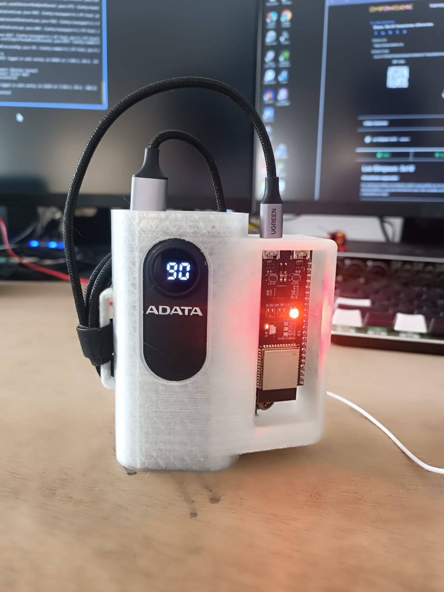

'El amor es la experiencia de que los otros no son otros.   
belleza es la experiencia de que los objetos no son objetos'.    
Rupert Spira    

  
# **interspecifics**

## entrainment

Entrainment es un entorno performativo transmedial que revela estados de coherencia cardíaca en respuesta a la escucha activa y en tiempo real de los latidos del corazón humano. Compuesta en vivo y de manera colaborativa, Entrainment presenta una sutil melodía que refleja sobre procesos de coherencia afectiva llendo del caos al unísono y viceversa.   

---
  
Entrainment is a transmedial performative environment that reveals states of cardiac coherence in response to active and real-time listening of human heartbeats. Composed live and collaboratively, Entrainment features a subtle melody that reflects on affective coherence shifting from chaos to unison and back.

## file structure

[ECG_device](https://github.com/interspecifics/entrainment/tree/main/ECG_device) code, firmware, and specifications that needs to be uploaded to set the ECG device behavior which is basically 1) gather ECG sensor signal, 2) apply real time processing to the signal and 3) broadcast data to the audiovisual performance control mechanisms. 
Must be uploaded to the ESP32-S2-DevKit-C devices with custom ECG sensor adapters.

[signal_processing](https://github.com/interspecifics/entrainment/tree/main/signal_processing) python code to process the ECG signal for exploratory data analysis, peak detection, Heart Rate Variability and entrainment analysis.

[sound_interface](https://github.com/interspecifics/entrainment/tree/main/sound_interface) components for a sound interface in real time performative heart sensing.

---

# ECG Entrainment System

## Version History and Comparison

| Version | Key Features | Signal Processing | ML Integration | Time Sync | Visualization |
|---------|-------------|-------------------|----------------|-----------|---------------|
| v1.0    | Basic QRS detection | Pan-Tompkins | None | Local time only | Basic plots |
| v2.0    | Signal quality metrics | Enhanced filtering | Basic prediction | NTP sync | Quality indicators |
| v3.0    | Multi-device support | Adaptive thresholds | Entrainment analysis | NTP + drift correction | Real-time status |
| v4.0    | Enhanced error handling | Optimized for ESP32 | Advanced ML models | Robust sync | Comprehensive monitoring |

## Latest Version (v4.0)

### Core Features
- Real-time ECG signal processing and QRS detection
- Multi-device synchronization and entrainment analysis
- Machine learning-based signal prediction and analysis
- Robust error handling and recovery mechanisms
- Comprehensive device status monitoring
- Advanced visualization system

### Signal Processing
- Optimized Pan-Tompkins algorithm implementation
- Adaptive thresholding for beat detection
- Signal quality assessment
- Real-time filtering and noise reduction
- Efficient memory management for ESP32

### Device Communication
- OSC-based message protocol
- NTP time synchronization
- Automatic device discovery and registration
- Connection status monitoring
- Message gap detection and analysis
- Error tracking and reporting

### Machine Learning Integration
- LSTM-based signal prediction
- Entrainment analysis between devices
- Phase synchronization detection
- Amplitude coupling analysis
- Temporal alignment assessment

### Visualization System
- Real-time ECG signal display
- Heart rate monitoring
- ML prediction visualization
- Device status dashboard
- Connection quality indicators
- Entrainment circular plot
- Performance metrics

### Device Status Monitoring
- Connection status (Connected/Disconnected)
- Signal quality indicators
- Message statistics
- Error tracking
- Network performance metrics
- Time synchronization status

## Files Included

### Firmware
- `main-QRS-timer.py`: Main ESP32 firmware with QRS detection
- `device_config.py`: Device configuration and NVS management

### Server
- `ecg_server.py`: Main server application
- `ml_engine.py`: Machine learning engine
- `ecg_server.log`: Server log file

## Pan-Tompkins Algorithm Implementation

### Signal Preprocessing
1. Bandpass filtering (5-15 Hz)
2. Derivative computation
3. Squaring for non-linear amplification
4. Moving window integration

### Processing Steps
1. Adaptive thresholding
2. Search back for missed beats
3. Refractory period enforcement
4. T-wave discrimination

### Performance Optimizations
- Fixed-point arithmetic
- Efficient buffer management
- Optimized memory usage
- Real-time processing capabilities

## Usage

### Device Setup
1. Configure device ID and network settings
2. Upload firmware to ESP32
3. Connect ECG sensor
4. Power on device

### Server Setup
1. Install required Python packages
2. Configure server settings
3. Start server application
4. Monitor device connections

### Monitoring
1. Launch visualization interface
2. Monitor device status
3. Track signal quality
4. Analyze entrainment patterns

## Requirements

### Hardware
- ESP32 development board
- ECG sensor
- Network connectivity

### Software
- Python 3.8+
- Required packages:
  - numpy
  - scipy
  - matplotlib
  - torch
  - pythonosc
  - pandas

## Future Improvements
- Enhanced error recovery mechanisms
- Additional ML model architectures
- Extended visualization capabilities
- Advanced signal processing algorithms
- Improved power management
- Extended device support

## Contributing
Please read CONTRIBUTING.md for details on our code of conduct and the process for submitting pull requests.

## License
This project is licensed under the MIT License - see the LICENSE file for details.

